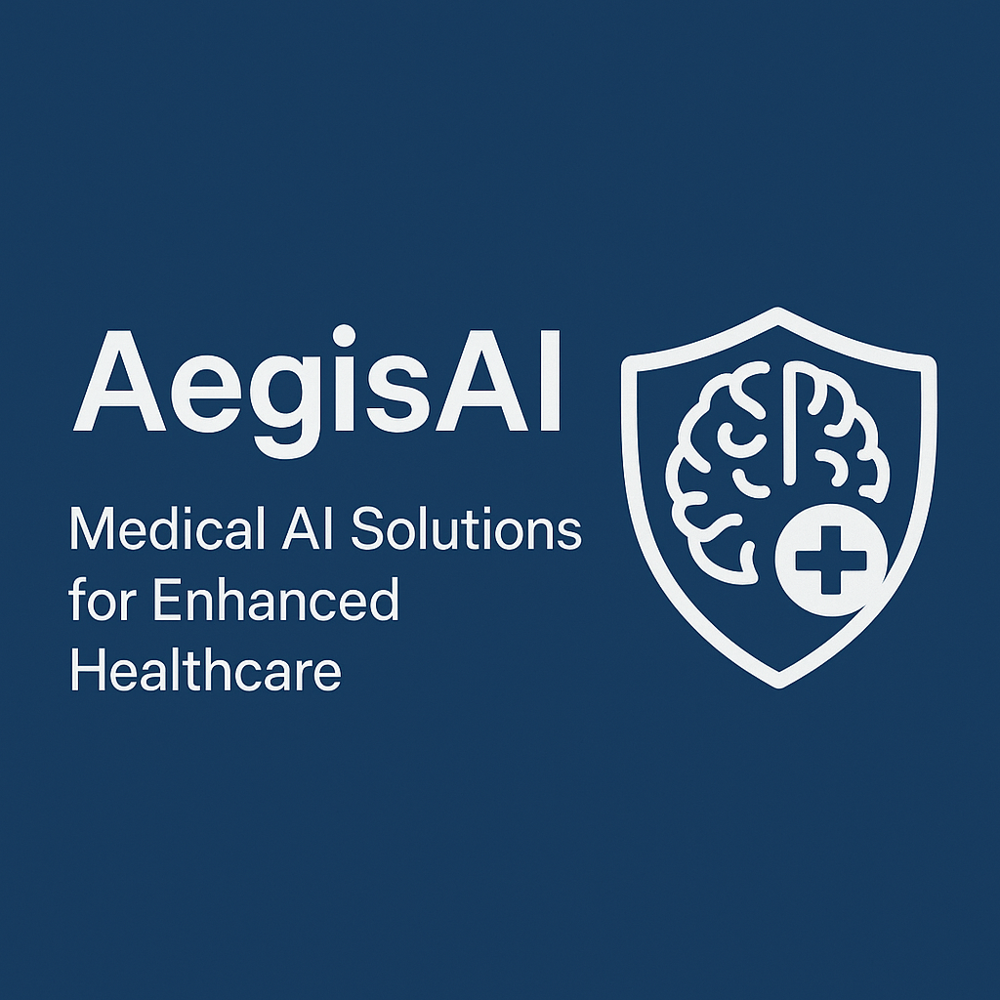

# 🛡️ AegisAI – Your Intelligent Medical Agent

AegisAI is a multi-agent conversational system built using Google's Agent Development Kit (ADK), designed to act as a digital health companion. It assists users with medical queries, doctor searches, mental health support, fitness advice, and more—all through an intelligent and modular architecture.




---

## 🚀 Live Demo

> [Access AegisAI on Cloud Run »](https://aegis-med-agent-913993225840.us-central1.run.app/)
> Or test locally: `adk web`

---

## 📌 Features

- 💬 Multi-agent architecture using Google ADK  
- 🤖 Gemini 2.0 Flash for advanced conversational AI  
- 🗺️ Google Places API integration to locate nearby doctors  
- 🧠 Sub-agents for diagnosis, counseling, nutrition, addiction support, etc.  
- 🌐 Cloud-native deployment on Google Cloud Run  
- 🔐 Secure `.env` management of API keys

---

## 🎯 Use Cases

- Quick medical advice and symptom checks  
- Mental health and addiction counseling  
- Diet, nutrition, and fitness guidance  
- Google-based medical searches  
- Real-time doctor/hospital location finder

---

## 📂 Project Structure

ADKStarterKit/
│
├── medical_agents/ # Root agent directory
│ ├── sub_agents/ # Contains modular sub-agents
│ ├── shared_libraries/ # Shared tools/functions
│ └── tools/ # Custom agent tools
├── .env # Environment variables (sensitive)
├── Dockerfile # For containerization
└── README.md # Project documentation


---

## ⚙️ Built With

- [Python 3.11](https://www.python.org/)  
- [Google Agent Development Kit (ADK)](https://github.com/google/generative-ai-docs)  
- [Gemini 2.0 Flash (Vertex AI)](https://cloud.google.com/vertex-ai)  
- [Google Cloud Run](https://cloud.google.com/run)  
- [Google Container Registry (GCR)](https://cloud.google.com/container-registry)  
- [Docker](https://www.docker.com/)  
- [Google Places API](https://developers.google.com/maps/documentation/places/web-service/overview)  
- PowerShell + WSL2 (for deployment setup)

---

## 🏗️ Deployment Instructions

### ✅ Prerequisites
- Docker and WSL2 set up on your machine
- Google Cloud CLI (`gcloud`) installed
- Enable Cloud Run, Vertex AI, and Container Registry APIs
- Create and link a billing-enabled GCP project

### 🚧 Steps

```bash
# 1. Set environment variables
set GOOGLE_CLOUD_PROJECT=your-gcp-project-id
set GOOGLE_CLOUD_LOCATION=us-central1
set SERVICE_NAME=aegis-med-agent
set APP_NAME=aegis-med-agent
set AGENT_PATH=./medical_agents
set GOOGLE_GENAI_USE_VERTEXAI=true

# 2. Build Docker image
docker build -t gcr.io/%GOOGLE_CLOUD_PROJECT%/%SERVICE_NAME% .

# 3. Push image to Container Registry
docker push gcr.io/%GOOGLE_CLOUD_PROJECT%/%SERVICE_NAME%

# 4. Deploy to Cloud Run
gcloud run deploy %SERVICE_NAME% ^
  --image gcr.io/%GOOGLE_CLOUD_PROJECT%/%SERVICE_NAME% ^
  --platform managed ^
  --region %GOOGLE_CLOUD_LOCATION% ^
  --allow-unauthenticated ^
  --port 8000

🙌 Acknowledgements
Google’s Generative AI tools & ADK

Vertex AI + Gemini APIs

Hackathon organizers & reviewers

All contributors and testers 🙏

📜 License
MIT License

👩‍💻 Authors
Byleen Janet Roy J 

